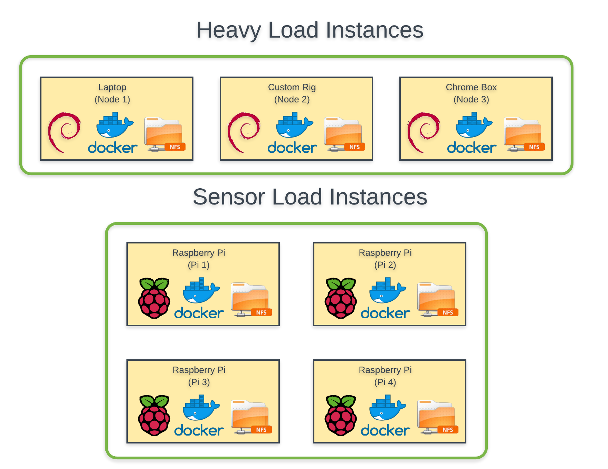

# Home-Infrastructure
## Table-of-Contents:

1. [Motivation](#Motivation)
2. [Asset-Overview](#Asset-Overview)
3. [Folder-Structure](#Folder-Structure)
4. [Master-Integration-List](#Master-Integration-List)
5. [Integration-Workflows:](#Integration-Workflows)
	1. [BLE-Services](#BLE-Services)

## Motivation:

> The goal of this project is to create a message based smart room that is powered by a microservice based architecture. All microservices will be using the redisMQ library to tether all microservices processes (more information located [here](https://github.com/curiousben/redisMQ-node)). Orchestration of microservices will be based off of docker swarm then Kubernetes.

## Asset-Overview:
* Instances:
	* Physical Assets:
		* Custom Rig
		* Toshiba
		* ChromeBox
		* Raspberry Pi 3
		* WeMo SmartRoom Products
	* Software:
		* Linux Debian
		* Docker
		* NFS
* Network:
	* Orchastration:
		* Docker Swarm
		* Kubernetes (After Swarm)
* Services:
	* Integrations:
		* BLE:
			* ProximityAware:
				* 	OverheadLights
	*  Languages:
		* Node.js(ES6)
		* Python (Version 2.7)
		* LUA
		* Bash
	* MessageTransport:
		* Redis

### Diagrams:

This following diagram shows a high-level view of the internal physical infrastructure:

## Folder-Structure:

1. Infrastructure: All service initialization scripts are located here. Service orchestration will vary according to new technologies, but there will always be shell scripts located here to bring up infrastructure.
2. Tools: Miscellaneous shell scripts that dont fit into this repository. They will be migrated to another repo that is for Miscellaneous scripts. _**TODO**_
3. Microservices: Microservice source code and packaging scripts.
4. Docs: Images and documents that is used documentation.
5. README.md: The documentation of this repository. You're reading it right now

## Master-Integration-List:

| Version | Tag         | Source | Destination     | Description                        | Current State |
|:-------:|:------------|:------:|:---------------:|:-----------------------------------|:-------------:|
| v1.0.0  | BLE2CLights | BLE    | ChristmasLights | BLE event driven christmas lights  | Development   |

## Integrations:

These integrations are the services that the home-infrastructure microservices help create.

### BLE-Services

* Status: Developement
* Designer: Ben Smith
* Developer: Ben Smith
* Design: [Here](./docs/Services/BLE/ProximityAware/OverheadLights/content.md)

