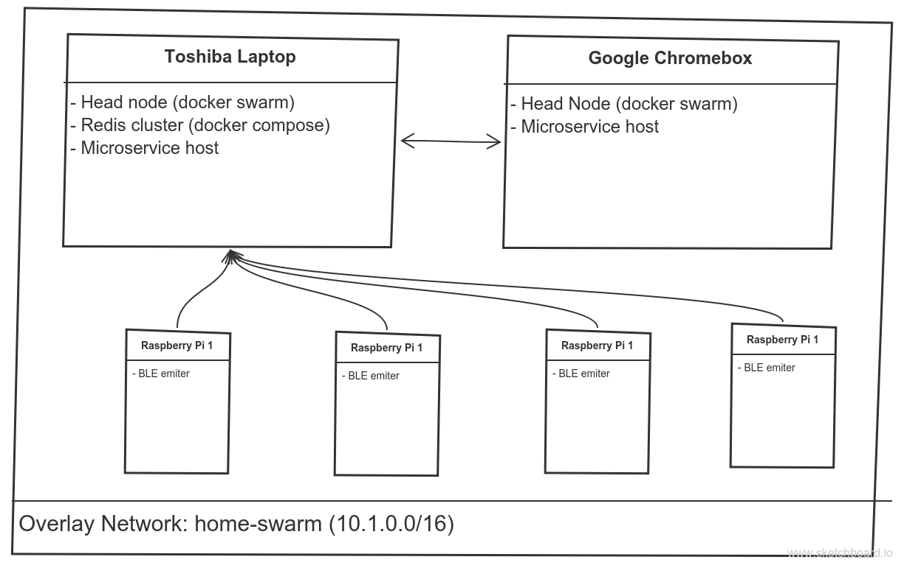

# Home-Infrastructure
## Table-of-Contents:

1. [Motivation](#Motivation)
2. [Asset-Overview](#Asset-Overview)
3. [Folder-Structure](#Folder-Structure)
4. [Master-Integration-List](#Master-Integration-List)
5. [Integration-Workflows:](#Integration-Workflows)
	1. [BLE-Services](#BLE-Services)

## Motivation:

> The goal of this project is to create a message based smart room that is powered by a microservice based architecture. All microservices will be using the redisMQ library to tether all microservices processes (more information located [here](https://github.com/curiousben/redisMQ-node)). Orchestration of microservices will be based off of docker swarm then Kubernetes.

## Asset-Overview:

* Infrastructure:
	* Orchastration:
		* Docker (Swarm && Compose)
		* Kubernetes (After Swarm)
	* Physical Assets:
		* Toshiba Laptop
		* Chromebox
		* 4 x RaspberryPi 3 (Raspbian)
		* WeMo SmartRoom Products
	* Software Used:
		* Docker
		* Redis
		* Linux (Ubuntu_16.04)
		* Raspbian
* Languages:
	* Node.js (ES6)
	* LUA
	* Shell
	* Python
* Integrations:
	* BLE-Services:
		* Christmas Lights

### Home-Infrastructure-Diagram:

This diagram shows a high-level view of the internal infrastructure:

## Folder-Structure:

1. Infrastructure: All service initialization scripts are located here. Service orchestration will vary according to new technologies, but there will always be shell scripts located here to bring up infrastructure.
2. Tools: Miscellaneous shell scripts to make life easier with installing developer environment or any utility scripts.
3. Microservices: Generic microservice source code and packaging scripts.
4. Docs: Images and documents that is used to create the README markdown file.
5. README.md: The documentation of this repository.

## Master-Integration-List:

| Version | Tag         | Source | Destination     | Description                        | Current State |
|:-------:|:------------|:------:|:---------------:|:-----------------------------------|:-------------:|
| v1.0.0  | BLE2CLights | BLE    | ChristmasLights | BLE event driven christmas lights  | Development   |

## Integrations:

These integrations are the services that the home-infrastructure microservices help create.

### BLE-Services

Status: Developement
Designer: Ben Smith
Developer: Ben Smith
Design: [Here](./docs/BLE-Services.md)